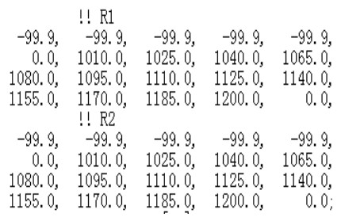
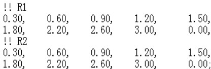
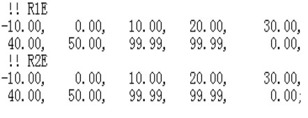

# 粗轧CFG

| 配置名称            | draft.cfg                                |                                          |               |
| --------------- | ---------------------------------------- | ---------------------------------------- | ------------- |
| 摘要：             | Configure  Static Draft object.(配置压下静态参数） |                                          |               |
|                 |                                          |                                          |               |
| 参数源代码           | 参数设定值（默认）                                | 参数注解（英）                                  | 参数含义          |
| alpha           | 1                                        | Initial  damping factor                  | 初始阻尼系数        |
| damp_mpy        | 1                                        | Multiplier  on damping factor, usually 1.0 | 阻尼乘积系数，通常=1.0 |
| conv_crit       | 0.02                                     | Convergence  criterion on loading        | 负载收敛判定准则      |
| max_dft_iter    | 20                                       | Maximum  iterations for draft closure    | 压下循环最大迭代次数    |
| max_dftlim_iter | 100                                      | Maximum iterations for limit resolution  | 压下分解最大迭代次数    |
| dft_crit        | 0.01                                     | Convergence  criterion on resolving draft limits | 压下分解收敛准则      |
| frc_crit        | 0.01                                     | Convergence  criterion on resolving force limits | 轧制力分解收敛准则     |
| pwr_crit        | 0.01                                     | Convergence  criterion on resolving power limits | 功率分解收敛准则      |
| dft_acc         | 1                                        | Draft  acceleration adjustment factor    | 压下加速调节因子      |
| frc_acc         | 1                                        | Force  acceleration adjustment factor    | 轧制力调节因子       |
| pwr_acc         | 1                                        | Power  acceleration adjustment factor    | 功率调节因子        |
| c_num_zlkfixed  | 10                                       | Max  number of Zlk fixed in iterations to resolve limits | 自学习迭代下限       |
| c_num_zlgfixed  | 15                                       | Max  number of Zlg fixed in iterations to resolve limits | 自学习迭代上限       |

| 配置名称                  | edg.cfg                                  |                                          |                       |
| --------------------- | ---------------------------------------- | ---------------------------------------- | --------------------- |
| 摘要：                   | Configure Static Edger (cEDG) objects.配置立辊静态常数 |                                          |                       |
| 参数源代码                 | 参数设定值（默认）                                | 参数注解（英）                                  | 参数含义                  |
| bitangle              | 21°                                      | bite  angle limit                        | 最大咬入角限制               |
| max edger force limit | 8000KN                                   | max  edger force limit                   | 最大轧制力限制               |
| gearat                | 6.9                                      | gear  ratio between edger and motor      | 立辊/马达齿轮转速比            |
| cof                   | 0.35                                     | coeficient  of friction                  | 摩擦系数                  |
| dmy_ofs               | 170                                      | dummied  stand gap offset                | E1/E2整作立辊空过时辊缝补偿      |
| chock_max_lmt         | 3350mm                                   | Max  chock openning - max center line openning of rolls | 最大轴承座开口度（最大辊缝）        |
| ddog_mlt              | 0.9                                      | double  dog bone multiplier              | 狗骨系数                  |
| max_ps_edg            | 0                                        | max passes for standalone edger          | 单立辊最大道次数              |
| dmy_ofs_fwd           | 10                                       | dummied  stand gap offset forward pass   | 奇道次立辊空过辊缝补偿           |
| dmy_ofs_rev           | 20                                       | dummied  stand gap offset reverse pass   | 偶道次立辊空过辊缝补偿           |
| 以下参数为孔型立辊配置           |                                          |                                          |                       |
| angle                 | 0°                                       | taper  or groove angle                   | 立辊锥形/孔型角度             |
| tapered               | FALSE                                    | tapered  edger indicator                 | 有锥形为T，无锥形F            |
| grooved               | FALSE                                    | grooved  edger indicator                 | 有孔型为T，无孔型为F           |
| throat                | 0mm                                      | working  part of edger roll              | 立辊接触面                 |
| diam_max              | 0mm                                      | max  diameter of grooved-edger           | 立辊最大直径                |
| diam_min              | 0mm                                      | min  diameter of grooved-edger           | 立辊最小直径                |
| pp_mod_max_draft      | 10mm                                     | Pass  to Pass increase draft limit       | 道次与道次间压下量增加限制（默认10mm） |

| 配置名称           | edg.cfg                                  |                                          |                 |
| -------------- | ---------------------------------------- | ---------------------------------------- | --------------- |
| 摘要：            | Configure Static Edger Schedule Generation  object.配置立辊静态参数 |                                          |                 |
| 参数源代码          | 参数设定值（默认）                                | 参数注解（英）                                  | 参数含义            |
| accuracy       | 0.1mm                                    | closure  tolerance                       | 立辊辊缝精度误差        |
| dft_lmt_dev    | 0.05                                     | Draft  near limit deviation setting      | 立辊压下极限偏差量       |
| frc_lmt_dev    | 0.05                                     | Force  near limit deviation setting      | 立辊轧制力极限偏差量      |
| pwr_lmt_dev    | 0.05                                     | Power  near limit deviation setting      | 立辊功率极限偏差量       |
| effi_minw      | 0.6                                      | average  edger efficiency at minimum width | 在最小宽度时立辊减宽效率    |
| effi_maxw      | 0.115                                    | average  edger efficiency at maximum width | 在最大宽度时立辊减宽效率    |
| minw           | 800mm                                    | Minimum  width for effi_minw value       | 最小宽度减宽效率对应的最小宽度 |
| maxw           | 2150mm                                   | Maximum  width for effi_minw value       | 最大宽度减宽效率对应的最大宽度 |
| c_num_zlefixed | 10                                       | Max  number of Zle fixed iterations      | 自学习最大迭代量        |

| 配置名称            | fce.cfg                                  |                                          |              |
| --------------- | ---------------------------------------- | ---------------------------------------- | ------------ |
| 摘要：             | Configure Static Motor (cFCE)  objects.配置加热炉静态参数 |                                          |              |
| 参数源代码           | 参数设定值（默认）                                | 参数注解（英）                                  | 参数含义         |
| fce_ext_tmp_def | 1240℃                                    | Default  Furnace extract temperature     | 默认出炉温度       |
| fce_ext_tmp_max | 1275℃                                    | Maximum  Furnace extract temperature     | 出炉最高温度设定限制   |
| fce_ext_tmp_min | 1170℃                                    | Minimum  Furnace extract temperature     | 出炉最低温度设定限制   |
| fce_rme_tim_def | 15s                                      | Default  Furnace to RM entry travel time | 板坯出炉至粗轧入口时间  |
| ext_delay       | 45s                                      | Furnace  extract delay                   | 加热炉出炉延时      |
| fcetbl_ofs      | 54m                                      | Offset  of furnace centerline into this table | 加热炉辊道补偿值     |
| fce_iter_max    | 15                                       | Maximum  number of Furnace extract temperature converged | 加热炉出炉温度最大迭代量 |
| fce_ofs_min     | -50                                      | Modified  Fce temperature offset minimum | 出炉温度修正补偿下限   |
| fce_ofs_max     | 20                                       | Modified  Fce temperature offset maximum | 出炉温度修正补偿上限   |

| 配置名称              | fce.cfg                                  |                                          |                        |
| ----------------- | ---------------------------------------- | ---------------------------------------- | ---------------------- |
| 摘要：               | Configure  Feedback Object for RSU.配置粗轧反馈值参数 |                                          |                        |
| 参数源代码             | 参数设定值（默认）                                | 参数注解（英）                                  | 参数含义                   |
| ratio_lmt_mx      | 1.25                                     | maximum  ratio of repredicted to measured force | 预测轧制力与实际轧制力之比不得超过1.25倍 |
| ratio_lmt_mn      | 0.75                                     | minmum ratio of repredicted to  measured force | 预测轧制力与实际轧制力之比不得低于0.75倍 |
| ratio_pwr_mx      | 1.75                                     | maximum  ratio of measured to predicted power | 预测功率与实际功率之比不得超过1.75倍   |
| ratio_pwr_mn      | 0.4                                      | minimum  ratio of measured to predicted power | 预测功率与实际功率之比不得低于0.4倍    |
| ff_terr_max       | 15                                       | maximum  temperature error to be used    | 温度最大预报误差量              |
| rdt_terr_lu       | 50                                       | RDT  upper temperature error to be used  | RDT最大预报误差量（上限）         |
| rdt_terr_ll       | -50                                      | RDT  lower temperature error to be used  | RDT最大预报误差量（下限）         |
| meas_force_min    | 100                                      | measured  force minimum                  | 测量最小轧制力（工作辊）           |
| meas_force_max    | 40000                                    | measured  force maximum                  | 测量最大轧制力（工作辊）           |
| meas_edgforce_min | 0                                        | measured  edger force minimum            | 测量最小轧制力（立辊）            |
| meas_edgforce_max | 6000                                     | measured edger force  maximum            | 测量最大轧制力（立辊）            |
| gap_abs_err       | 3                                        | Absolute  stand gap error to declare measured gap error | 工作辊辊缝偏差                |
| edg_gap_err       | 50                                       | Absolute  edger gap error to declare measured gap error | 立辊辊缝偏差                 |
| min_temp          | 900                                      | minimum  RM exit temperature             | 板坯最低粗轧出口温度限制           |
| fcerme_max        | 30s（1#）40s（2#）                           | max  time furnace to rm entry            | 板坯从加热炉至粗轧入口的最长运输时间限制   |
| rmerm_max         | 100s                                     | max  time rm entry to stand              | 粗轧入口至机架（R1）的最长运输时间限制   |

| 配置名称                | hdr.cfg                                  |                                          |              |
| ------------------- | ---------------------------------------- | ---------------------------------------- | ------------ |
| 摘要：                 | Configure  Static Spray Header (cHdr) objects.配置粗轧喷淋集管静态参数 |                                          |              |
| 参数源代码               | 参数设定值（默认）                                | 参数注解（英）                                  | 参数含义         |
| rmds_hdr（粗轧除鳞集管/喷嘴） |                                          |                                          |              |
| capacity            | 100.8                                    | header capacity                          | 集管容量         |
| flw_max             | 100                                      | maximum  flow                            | 最大流量         |
| flw_min             | 100                                      | minimum  flow                            | 最小流量         |
| sim_min             | 1                                        | minimum  spray intensity multplier       | 最小流量时流量增强系数  |
| flw_est             | 100                                      | establishment  flow：minimum flow needed to turn spray on | 阀门开启所需要的最小流量 |
| rds_hdr             |                                          |                                          |              |
| capacity            | 113.1                                    | header capacity                          | 集管容量         |
| flw_max             | 100                                      | maximum  flow                            | 最大流量         |
| flw_min             | 100                                      | minimum  flow                            | 最小流量         |
| sim_min             | 1                                        | minimum  spray intensity multplier       | 最小流量时流量增强系数  |
| flw_est             | 100                                      | establishment  flow：minimum flow needed to turn spray on | 阀门开启所需要的最小流量 |

| 配置名称         | learn.cfg                                |                                          |              |
| ------------ | ---------------------------------------- | ---------------------------------------- | ------------ |
| 摘要：          | Configure Static System Object for  Learn。配置静态自学习参数 |                                          |              |
| 参数源代码        | 参数设定值（默认）                                | 参数注解（英）                                  | 参数含义         |
| tgt_rm_km    | bd(bd=body;hd=head)                      | RM deformation  resistance model target point | 粗轧变形抗力自学习目标点 |
| tgt_rm_p     | bd(bd=body;hd=head)                      | RM roll force model  target point        | 粗轧轧制力自学习目标点  |
| tgt_rm_g     | bd(bd=body;hd=head)                      | RM roll torque model  target point       | 粗轧扭矩模型自学习目标点 |
| tgt_edger_km | bd(bd=body;hd=head)                      | Edger deformation  resistance model target point | 立辊变形抗力自学习目标点 |
| tgt_edger_p  | bd(bd=body;hd=head)                      | Edger roll force  model target point     | 立辊轧制力自学习目标点  |
| tgt_wid_def  | bd(bd=body;hd=head)                      | Width deformation  model target point !!@J015 | 宽展模型自学习目标点   |

| 配置名称             | log.cfg                                  |                                          |                     |
| ---------------- | ---------------------------------------- | ---------------------------------------- | ------------------- |
| 摘要：              | Configure Log Object for RSU.配置RSU的log日志参数 |                                          |                     |
| 参数源代码            | 参数设定值（默认）                                | 参数注解（英）                                  | 参数含义                |
| frwd             | TRUE                                     | Print setup piece  state                 | 输出板坯设定数值            |
| fbk_pce_state    | TRUE                                     | Print feedback piece  state              | 输出板坯反馈（实测）值         |
| output_hd_tl     | FALSE                                    | Output head and tail  portions of log    | 输出板坯头尾端单独log数据      |
| temp_curves      | FALSE                                    | Output piece  temperature curves         | 输出板坯温度曲线            |
| oneline_log      | TRUE                                     | Output output oneline  log               | 输出在线log日志           |
| output_tvd       | TRUE                                     | Output TVD calculated  data              | 输出TVD计算所得数据         |
| output_hd        | TRUE                                     | Output hd segment  data                  | 输出头部数据              |
| output_bd        | TRUE                                     | Output bd segment data                   | 输出中段数据              |
| output_tl        | TRUE                                     | Output tl segment data                   | 输出尾部数据              |
| output_ex_spy    | FALSE                                    | Output exit sprays  indicator            | 输出喷嘴出口流量/压力         |
| output_lube      | FALSE                                    | output edger/stand  lubrication indicator | 输出立辊/机架润滑压力         |
| log_head_obj     | TRUE                                     | Log head chain  objects to system log    | 板坯头部log日志与系统log日志捆绑 |
| log_body_obj     | TRUE                                     | Log body chain objects to system log     | 板坯中段log日志与系统log日志捆绑 |
| log_tail_obj     | TRUE                                     | Log tail chain objects to system log     | 板坯尾部log日志与系统log日志捆绑 |
| log_rec_sup      | FALSE                                    | output setup logging  records            | 输出log日志设定记录         |
| log_rec_fbk      | FALSE                                    | output feedback  logging records         | 输出log日志反馈记录         |
| multiple_c2_file | TRUE                                     | Generate multiple c2  files              | 生成C2文件              |

| 配置名称      | map.cfg                                  |                                       |                   |
| --------- | ---------------------------------------- | ------------------------------------- | ----------------- |
| 摘要：       | Configure MAP Objects for RSU.配置RSU的map策略参数 |                                       |                   |
| 参数源代码     | 参数设定值（默认）                                | 参数注解（英）                               | 参数含义              |
| frwd      | true/false                               | true if forward  direction            | 精轧方向为T，逆向轧制为F     |
| tndm      | true/false                               | true if downstrean is  tandem pass    | 串联轧制为T            |
| sdummy    | true/false                               |                                       | 工作辊空过             |
| edummy    | true/false                               |                                       | 入口立辊空过            |
| xdummy    | true/false                               |                                       | 出口立辊空过            |
| awc       | true/false                               |                                       | 使用AWC道次T，不使用F     |
| hdft_max  |                                          | maximum horizontal  draft to be taken | 平辊每道次最大压下量限制      |
| hdft_min  |                                          | minimum horizontal  draft to be taken | 平辊每道次最小压下量限制      |
| vdft_max  |                                          | maximum edger draft  to be taken      | 立辊每道次最大压下量限制      |
| vdft_min  |                                          | minimum edger draft  to be taken      | 立辊每道次最小压下量限制      |
| effwd     | true/false                               | true if edger  feedforward enabled    | 立辊前馈使用则为T（大多情况为F） |
| effgn     | true/false                               | edger feedforward  gain               | 立辊前馈系数            |
| len_max   |                                          | max length                            | 最大长度              |
| delay_ent | 2s                                       | delay on entry side  of a pass        | 板坯入口延时时间          |

| 配置名称      | mill.cfg                                 |                                      |           |
| --------- | ---------------------------------------- | ------------------------------------ | --------- |
| 摘要：       | Configure mill Objects for  RSU.配置RSU的轧线（中间坯厚度，宽度）参数 |                                      |           |
| 参数源代码     | 参数设定值（默认）                                | 参数注解（英）                              | 参数含义      |
| awcWidTbl | 4（900,1200,1500,0）                       | Break points for  width range by AWC | AWC宽度范围分类 |
| XgagTbl   | 10（23, 26, 29, 32, 36, 40, 45, 50, 55, 0） | Break points for  gauge range at RMX | 粗轧出口厚度分类  |

| 配置名称                 | mtr.cfg                                  |                                          |                             |
| -------------------- | ---------------------------------------- | ---------------------------------------- | --------------------------- |
| 摘要：                  | Configure  Static Motor (cMTR) objects.配置静态马达(e1,r1,e2,r2)风机参数 |                                          |                             |
| 参数源代码                | 参数设定值（默认）                                | 参数注解（英）                                  | 参数含义                        |
| E1（E2，R1，R2)见mtr.cfg |                                          |                                          |                             |
| base_rpm             | 180                                      | base rpm                                 | 基本转速                        |
| top_rpm              | 320                                      | maximum rpm                              | 最大转速                        |
| max_rpm_pu           | 1                                        | maximum setup rpm as  ratio of maximum rpm | 最大设定转速与实际最大转速之比             |
| min_rpm_pu           | 1                                        | minimum setup rpm as  ratio of base rpm  | 最小设定转速与基本转速之比（等于基本转速）       |
| power_rate           | 3000                                     | motor power rating                       | 电机额定功率                      |
| thd_ovrl             | 2.25                                     | power limit for  thread speed            | 穿带速度电机标幺值限制                 |
| base_ovrl            | 2.25                                     | power limit for base  speed              | 基本速度电机标幺值限制                 |
| top_ovrl             | 2.25                                     | power limit for max  speed               | 最大速度电机标幺值限制                 |
| effi_gear            | 0.99                                     | gear and coupling  efficiency            | 齿轮耦合效率                      |
| bear_loss            | 0                                        | bearing loss factor                      | 轴承损耗系数                      |
| base_revtime         | 1                                        | base speed reversal  time                | 基本速度调头/反转时间（reversal  time) |
| top_revtime          | 3                                        | top  speed reversal time                 | 最大速度调头/反转时间（reversal  time) |
| effi                 | 0.95                                     | motor efficiency                         | 电机效率                        |
| dissip               | 0                                        | heat  dissipation ratio, required for rms calcs | 热流失比率，需要通过计算得出              |
| rectim               | 0.1s                                     | motor  acceleration recovery time, req'd for lead speed calcs | 电机加速恢复时间，需要通过引导速度计算得出       |
| base_volts           | 1640                                     | motor  volts at base speed               | 在基本转速下电机电压                  |
| power_fac            | 0.8                                      | motor  power factor                      | 电机功率系数                      |
| spd_fixed            | FALSE                                    | indicator  for fixed speed motor         | 电机修正速度指示表                   |

| 配置名称              | mtr.cfg                                  |                                          |              |
| ----------------- | ---------------------------------------- | ---------------------------------------- | ------------ |
| 摘要：               | Configure PDI Objects for RSU_Srv.配置粗轧静态PDI数值 |                                          |              |
| 参数源代码             | 参数设定值（默认）                                | 参数注解（英）                                  | 参数含义         |
| slabg             | 225                                      | Cold slab thickness                      | 冷坯厚度         |
| slabl             | 7000                                     | Cold slab length                         | 冷坯长度         |
| slabw             | 1300                                     | Cold slab width                          | 冷坯宽度         |
| fxhaim            | 5                                        | FMX gauge target  (cold)                 | 精轧目标厚度       |
| fxwaim            | 1300                                     | FMX width target  (cold)                 | 精轧目标宽度       |
| rmx_thick         | 0                                        | RM exit target  thickness                | 粗轧出口厚度       |
| taper_slab        | TRUE                                     | taper slab flag                          | 楔形坯标识        |
| taper_head_thick  | 225                                      | Thickess of head of  tapered slab (cold) | 楔形坯头部厚度      |
| taper_tail_thick  | 225                                      | Thickess of tail of  tapered slab (cold) | 楔形坯尾部厚度      |
| taper_start_thick | 2000                                     | Distance from head where thickness taper  starts (cold) | 头部至楔形开始处板坯厚度 |
| taper_end_thick   | 5000                                     | Distance from head where thickness taper  ends (cold) | 头部至楔形结束处板坯厚度 |
| taper_head_width  | 1300                                     | Width of head of tapered slab (cold)     | 楔形坯大头宽度      |
| taper_tail_width  | 1290                                     | Width of tail of  tapered slab (cold)    | 楔形坯小头宽度      |
| taper_start_width | 2000                                     | Distance from head  where width taper starts (cold) | 头部至大头楔形开始距离  |
| taper_end_width   | 5000                                     | Distance from head  where width taper ends (cold) | 头部至小头楔形开始距离  |

| 配置名称                    | rollbite.cfg                             |                                          |                              |
| ----------------------- | ---------------------------------------- | ---------------------------------------- | ---------------------------- |
| 摘要：                     |                                          |                                          |                              |
| 参数源代码                   | 参数设定值（默认）                                | 参数注解（英）                                  | 参数含义                         |
| r_zlk_stra_range = 20,  | R1（1.50,    3.00,     4.50,    6.00,      7.50,9.00,   12.00,    15.00,   18.00,      0.00 R2 1.50,    3.00,     4.50,    6.00,      7.50,9.00    12.00,    15.00,   18.00,      0.00; | z_lk strain index  range for RM defomation resistance. | 粗轧变形抗力自学习分档（R1 10档，R2  10档）  |
| r_zlk_temp_range=40     |                     | z_lk temperature  index range for RM defomation resistance. | 温度对变形抗力自学习的分档（R1 20档，R2 20档） |
| r_zlg_ldhm_range  = 20  |                     | z_lg width draft index range for RM torque. | 减宽量对扭矩自学习的分档                 |
| e_zlke_drft_range  = 20 |                     | z_lke width draft  index range for edger defomation resistance. | 减宽量对立辊变形抗力自学习的影响             |

| 配置名称    | rzterm.cfg                               |                                          |                          |
| ------- | ---------------------------------------- | ---------------------------------------- | ------------------------ |
| 摘要：     | Configure Static  Laerning term object.配置粗轧自学习参数 |                                          |                          |
| 参数源代码   | 参数设定值（默认）                                | 参数注解（英）                                  | 参数含义                     |
| z_type  | 1                                        | Learning type.  mulitiplicative type     | 乘法自学习                    |
| z_type  | 2                                        | Learning type.  additive type            | 加法自学习                    |
| z_kind  | 1                                        | Learning kind. Lot to  lot learning      | LOT  TO LOT 自学习          |
| z_kind  | 2                                        | Learning kind. Bar to  bar learning each pass Edger | 立辊每道次BAR TO BAR 自学习      |
| z_kind  | 3                                        | Learning kind. Bar to  bar learning each stand | 每机架（R1/R2）BAR TO  BAR自学习 |
| z_kind  | 4                                        | Learning kind. Bar to  bar learning pass to pass | 每道次 BAR TO BAR 自学习       |
| cnt_max | 0-3                                      | Maximum number for  executing lot to lot learning | 学习多少块更新自学习系数             |