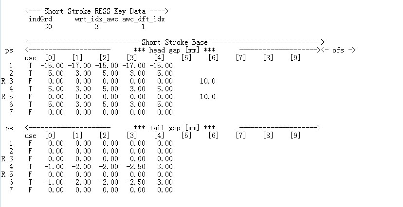

# RSU 日志

粗轧RSU日志主要分为以下几大块。

## 基本信息

钢卷基本信息，如卷号、原料尺寸等。

## 各区域入出口参数计算（重要！）

包括粗轧入出口、精轧入出口板坯尺寸，热膨胀系数，温度，宽展，回展，自学习值等。

## 钢种分档

 钢种牌号、钢种族、材质代码、厚度代码、宽度代码、喷淋代码、牌号代码、加热炉号、压下分配模式等；

## 系统参数记录

操作人员宽度补偿，厚度补偿，立辊平辊载荷分配、载荷比等。

## 粗轧各道次参数数据

包括道次，辊缝，入出口厚度/宽度/长度，前后滑，温度预报，压下量，最大/最小轧制力等极限检查。

## 各道次扭矩计算

## 各道次辊缝计算

包括轧辊弹跳、标定弹跳、辊缝补偿、油膜厚度、轧辊磨损、轧辊膨胀等辊缝构成因素。

## 轧辊数据

包括轧辊吨位、轧制公里数、辊号、、材质、辊凸度、磨损等。

## 短行程参数（重要）

包括各道次短行程头尾参数设定值及操作人员补偿值，对宽度控制比较重要。

## 温度及除鳞数据

通过冷却水对流换热及T.VD曲线计算各道次入口温度，出口温度。

## 自学习值更新

所有自学习值更新均存储在RMX的日志文件内，其中SWTICH代表自学习开关，1代表自学习关闭，2代表自学习开启，SIGMACNT代表多少块更新一次长期自学习。

